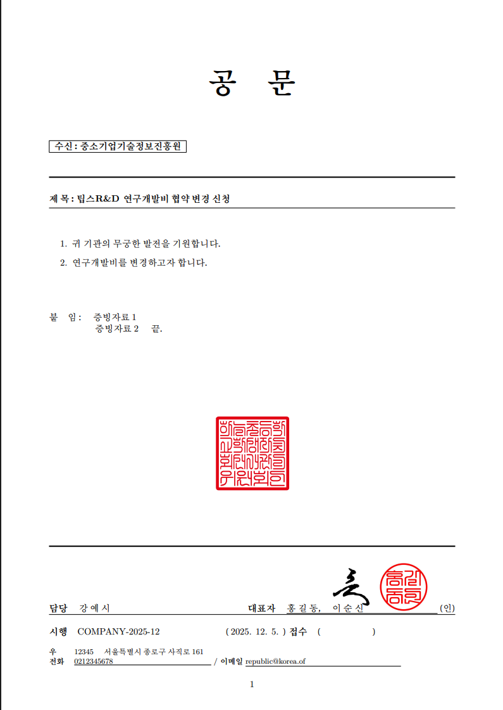

# 공문 생성기 📄

한국식 공문서 양식의 PDF를 웹에서 간편하게 생성하는 오픈소스 도구입니다.

## ✨ 주요 기능

| 기능 | 설명 |
|------|------|
| 웹 기반 폼 | 직관적인 UI로 공문서 작성 |
| 직인/도장 삽입 | 기관 직인 및 대표자 도장 이미지 지원 |
| 복수 대표자 | 여러 대표자 도장 자동 배치 |
| 한글 이름 처리 | 한글 이름 자동 띄어쓰기 (예: 홍길동 → 홍 길 동) |
| 고품질 PDF | LaTeX(XeLaTeX) 기반 출력 |

## 📸 스크린샷



## 🔧 요구사항

- Node.js 20 이상
- XeLaTeX (texlive-xetex)
- 한글 폰트 (fonts-nanum 또는 시스템 한글 폰트)

## 🚀 설치 및 실행

### Docker 사용 (권장)

가장 간단한 방법입니다. 별도의 LaTeX 설치가 필요 없습니다.

```bash
# 이미지 빌드
docker build -t gongmun-gen .

# 컨테이너 실행
docker run -p 3000:3000 gongmun-gen
```

### 로컬 실행

#### macOS

```bash
# MacTeX 설치 (약 4GB, 시간이 오래 걸릴 수 있음)
brew install --cask mactex

# 서버 실행
node server.js
```

#### Ubuntu / Debian

```bash
# 필수 패키지 설치
sudo apt-get update
sudo apt-get install -y texlive-xetex texlive-lang-korean fonts-nanum

# 서버 실행
node server.js
```

#### Windows

1. [MiKTeX](https://miktex.org/download) 설치
2. MiKTeX Console에서 `xetex`, `kotex` 패키지 설치
3. 서버 실행:
```bash
node server.js
```

### 접속

브라우저에서 http://localhost:3000 접속

## 📝 사용법

### 기본 작성 순서

1. **기본 정보** - 수신처, 문서번호, 날짜, 제목 입력
2. **본문 항목** - 내용 추가 (첫 번째 인사말은 자동 포함)
3. **붙임** - 첨부서류 목록 추가
4. **발신 기관** - 기관 직인 이미지 업로드, 담당자명 입력
5. **대표자** - 대표자 정보 및 도장 이미지 추가
6. **연락처** - 우편번호, 주소, 전화번호, 이메일 입력
7. **PDF 생성** 버튼 클릭

### 이미지 권장 사양

| 항목 | 권장 형식 | 권장 크기 |
|------|----------|----------|
| 기관 직인 | PNG (투명 배경) | 300x300px 이상 |
| 대표자 도장 | PNG (투명 배경) | 200x200px 이상 |

> 💡 **팁**: 투명 배경 PNG를 사용하면 문서에 자연스럽게 삽입됩니다.

## 📁 프로젝트 구조

```
gongmun_gen/
├── server.js       # HTTP 서버 및 PDF 생성 로직
├── index.html      # 웹 폼 UI (프론트엔드)
├── Dockerfile      # Docker 이미지 설정
├── letter.tex      # LaTeX 템플릿 참고용
└── README.md       # 이 문서
```

### 기술 스택

- **백엔드**: Node.js (순수 http 모듈, 외부 의존성 없음)
- **프론트엔드**: Vanilla HTML/CSS/JavaScript
- **PDF 생성**: XeLaTeX
- **컨테이너**: Docker

## 🔍 문제 해결

### LaTeX 컴파일 오류

PDF 생성 실패 시 서버 콘솔에 LaTeX 로그가 출력됩니다. 주요 원인:

- **폰트 없음**: 나눔 폰트 설치 확인
- **패키지 없음**: `kotex` 패키지 설치 필요
- **특수문자**: 일부 특수문자는 자동 이스케이프되지만, 문제 발생 시 제거 후 재시도

### Docker 빌드 실패

```bash
# 캐시 없이 재빌드
docker build --no-cache -t gongmun-gen .
```

### 한글이 깨지는 경우

시스템에 한글 폰트가 설치되어 있는지 확인하세요:

```bash
# Ubuntu/Debian
fc-list :lang=ko

# macOS
fc-list :lang=ko
```

## 🤝 기여하기

1. 이 저장소를 Fork 합니다
2. 새 브랜치를 생성합니다 (`git checkout -b feature/새기능`)
3. 변경사항을 커밋합니다 (`git commit -m '새 기능 추가'`)
4. 브랜치에 Push 합니다 (`git push origin feature/새기능`)
5. Pull Request를 생성합니다

### 개선 아이디어

- [ ] 공문서 템플릿 저장/불러오기
- [ ] 다양한 공문서 양식 지원
- [ ] 미리보기 기능
- [ ] 서명 이미지 직접 그리기

## 📄 라이선스

MIT License

Copyright (c) 2024

이 소프트웨어는 MIT 라이선스에 따라 자유롭게 사용, 수정, 배포할 수 있습니다.
자세한 내용은 [LICENSE](LICENSE) 파일을 참조하세요.
